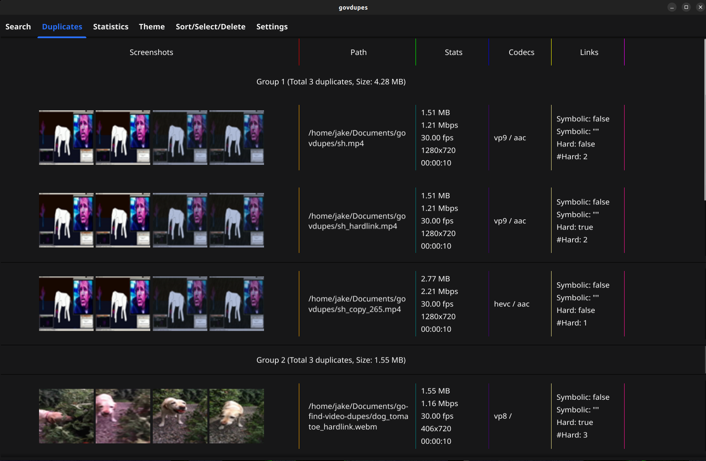
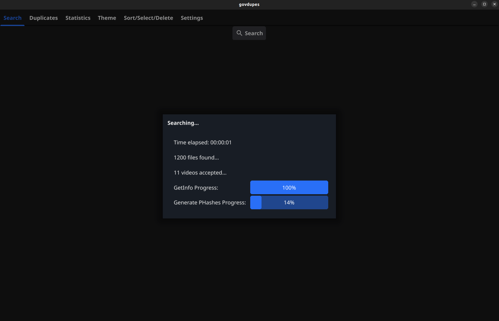
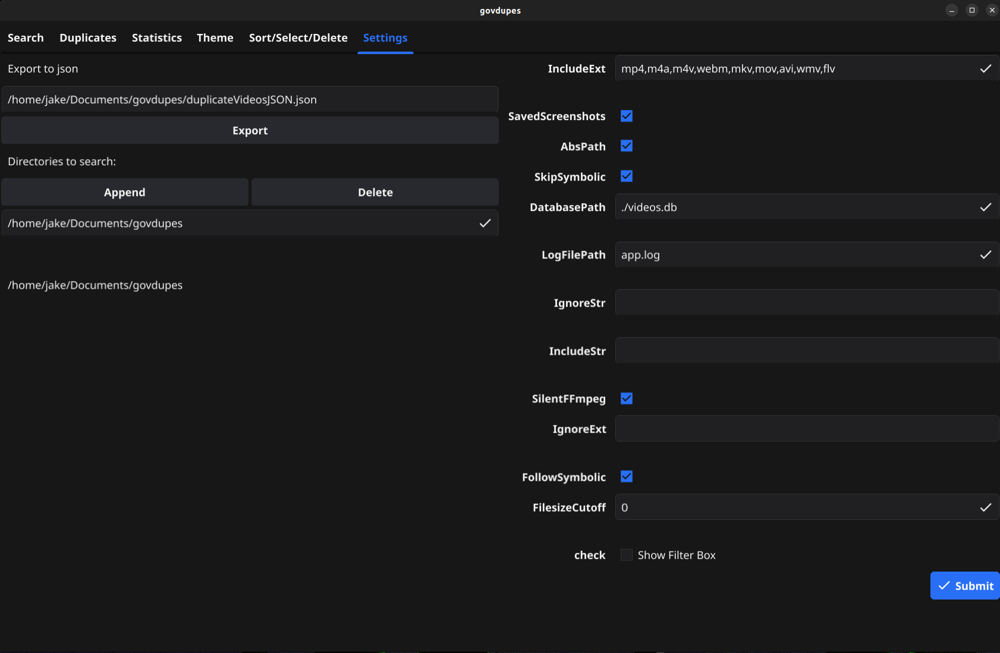
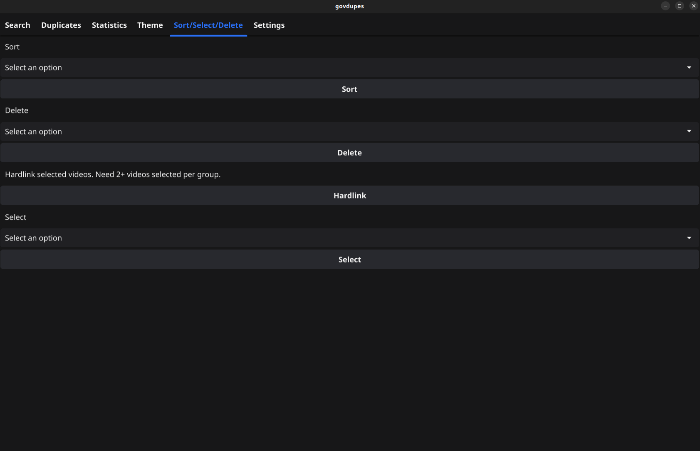
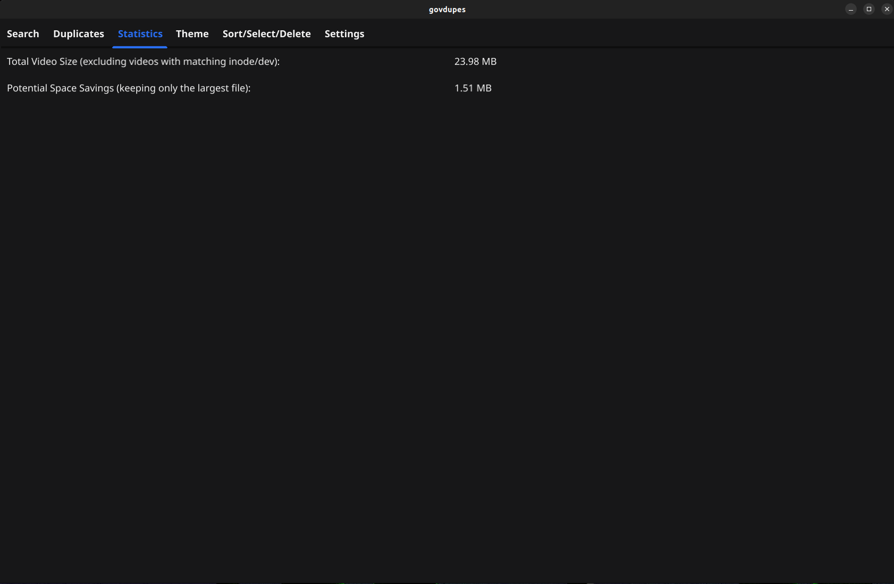
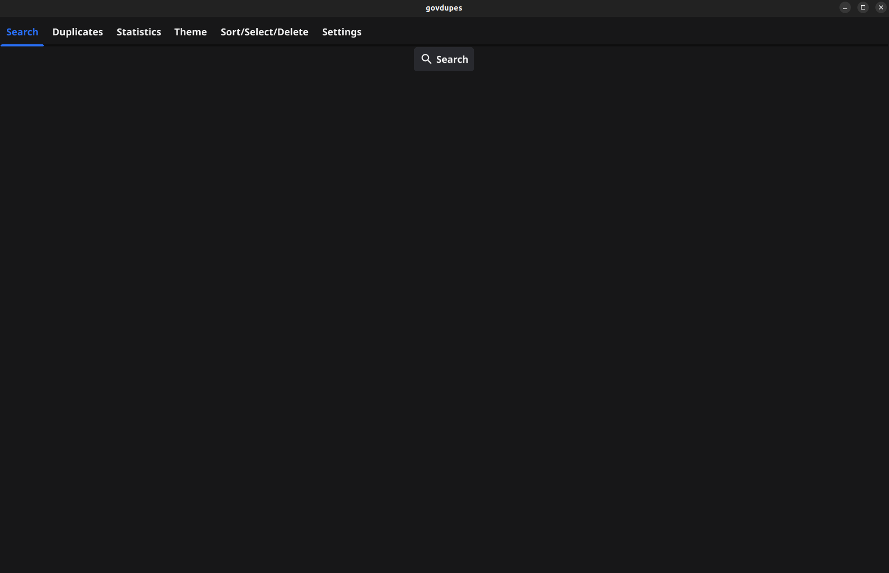

# govdupes
Uses perceptual hashing of screenshots taken from videos to detect duplicate
but not identical (different encoding, slight filter, short duration differences) videos. 

## Screenshots

Group size = Sum of directory entries with unique inode & device id
- 
- 
- 
Hardlink will hardlink each selected video in the video group's row to the
first video in said row. 
- 
- 
- 

